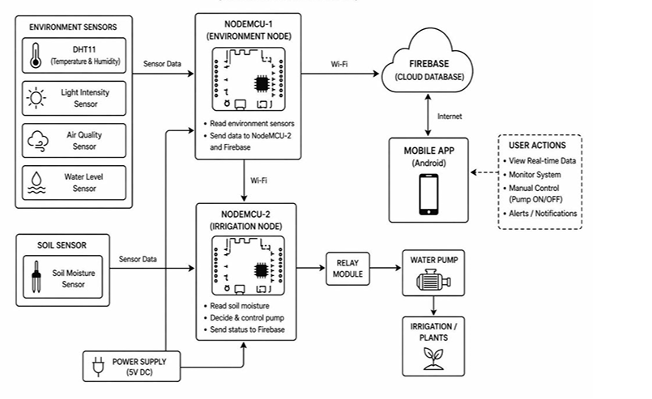
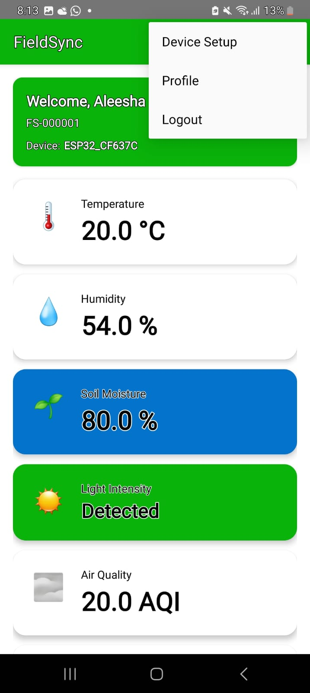
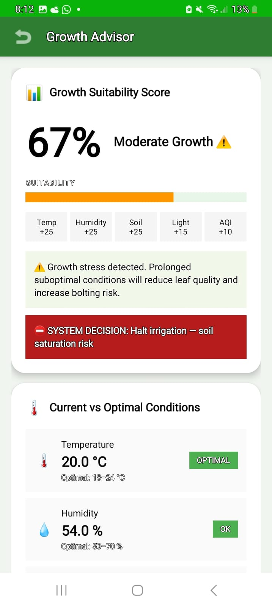
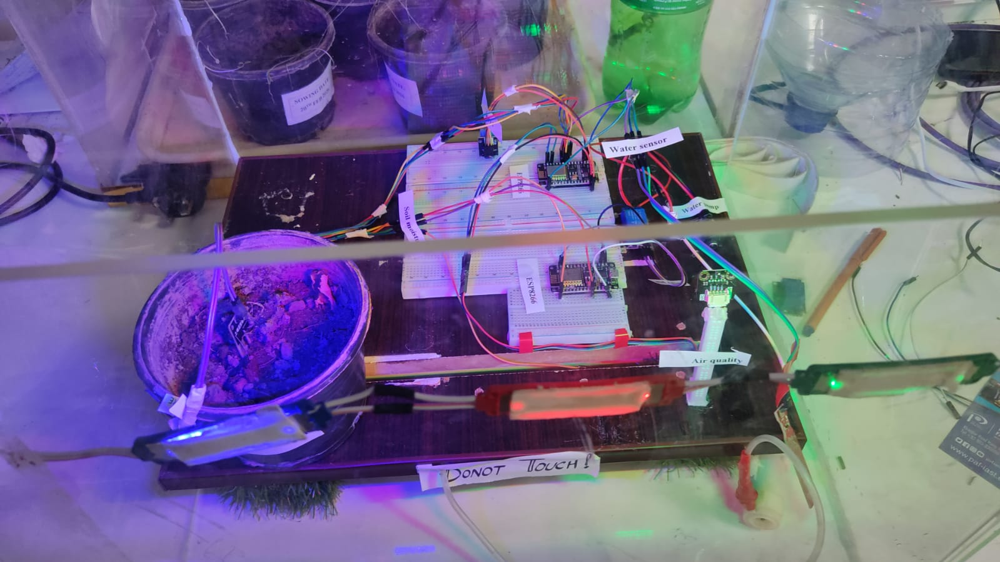

# IoT-Based Smart Irrigation System for Non-Seasonal Plants

> **Final Year Project | BS Computer Science | PAF-IAST**

An IoT-based smart irrigation and environmental monitoring system developed for the controlled cultivation of non-seasonal plants, with **lettuce (*Lactuca sativa*) used as the target crop**.

The system integrates environmental and soil sensors, dual NodeMCU ESP8266 controllers, Firebase Realtime Database, automated irrigation, and a custom Android application called **FieldSync** for real-time monitoring, remote control, threshold configuration, alerts, and environmental data visualization.

> **Repository Notice:** This repository serves as a technical showcase of the project. The FieldSync Android application source code and embedded-system source code are not publicly distributed.

---

##  Project Overview

Cultivating plants outside their normal seasonal conditions requires continuous monitoring of environmental parameters and careful irrigation management.

This project was developed as an integrated smart-agriculture system capable of monitoring plant-growing conditions, transmitting sensor information to the cloud, automatically controlling irrigation, and providing remote monitoring and control through an Android application.

The system was implemented and evaluated using **lettuce** as the target crop.

### Core Objectives

- Monitor environmental and soil conditions in real time.
- Automate irrigation based on soil-moisture thresholds.
- Synchronize sensor and irrigation data through the cloud.
- Provide remote monitoring through a mobile application.
- Allow manual irrigation control when required.
- Provide configurable environmental thresholds.
- Visualize historical environmental data.
- Reduce unnecessary manual intervention and improve irrigation management.

---

## System Architecture

The system uses a **dual-NodeMCU architecture** that separates environmental monitoring from irrigation control.

- **NodeMCU-1 — Environment Node:** collects environmental sensor readings and communicates data through Wi-Fi.
- **NodeMCU-2 — Irrigation Node:** monitors soil moisture and controls the irrigation pump through a relay module.
- **Firebase Realtime Database:** provides cloud-based synchronization between the IoT system and the mobile application.
- **FieldSync:** provides the user interface for monitoring, control, thresholds, analytics, and alerts.

<p align="center">
  
</p>

### Data and Control Flow

```text
Environmental Sensors
        ↓
NodeMCU-1 (Environment Node)
        ↓
Firebase Realtime Database
        ↕
FieldSync Android Application


Soil Moisture Sensor
        ↓
NodeMCU-2 (Irrigation Node)
        ↓
Relay Module
        ↓
Water Pump
        ↓
Irrigation / Plants
```

The architecture enables environmental information to move from the physical sensing layer to the cloud and mobile application while the irrigation node independently handles soil-moisture-based pump control.

---

##  FieldSync Android Application

**FieldSync** is the Android application developed as the monitoring and control interface for the smart irrigation system.

The application communicates with Firebase to provide access to current environmental conditions, irrigation information, configurable system parameters, and historical data.

### Key Features

- Real-time temperature monitoring
- Humidity monitoring
- Soil-moisture monitoring
- Light-intensity monitoring
- Air-quality monitoring
- Water-level monitoring
- Pump status monitoring
- Manual pump ON/OFF control
- Automatic irrigation support
- Configurable sensor thresholds
- Historical sensor-data visualization
- Daily, weekly, and monthly analytics
- Device management
- Alerts and notifications
- Plant-growth monitoring/advisory interface
- Firebase cloud synchronization

---

## FieldSync Interface

### Real-Time Dashboard

The FieldSync dashboard provides a consolidated view of current environmental and soil conditions received through the IoT system.

<p align="center">
  
</p>

### Irrigation Control

The pump-control interface allows irrigation status to be monitored and provides manual control when required.

<p align="center">
  
</p>

### Environmental Analytics

FieldSync provides graphical visualization of historical environmental measurements to help observe changes in growing conditions over time.

<p align="center">
  
</p>

### Threshold Configuration

Users can configure environmental and irrigation thresholds according to the requirements of the cultivation environment.

<p align="center">
  
</p>

### Growth Monitoring

The application also includes a plant-growth monitoring/advisory interface for presenting crop-condition information.

<p align="center">
  
</p>

---

##  Automated Irrigation

Automated irrigation is one of the core functions of the system.

The irrigation node continuously monitors soil moisture and determines whether irrigation is required according to the configured threshold.

```text
             Monitor Soil
                  │
                  ▼
        Read Soil Moisture
                  │
                  ▼
       Compare With Threshold
                  │
          ┌───────┴────────┐
          │                │
     Moisture Low     Moisture Sufficient
          │                │
          ▼                ▼
       Pump ON           Pump OFF
          │                │
          └───────┬────────┘
                  │
                  ▼
          Update Pump Status
                  │
                  ▼
        Synchronize with Cloud
                  │
                  ▼
          Update FieldSync
                  │
                  ▼
          Continue Monitoring
```

Manual irrigation control is also available through FieldSync when user intervention is required.

---

##  Firebase Cloud Integration

**Firebase Realtime Database** provides the communication layer between the physical IoT system and FieldSync.

It is used for:

- Real-time sensor-data synchronization
- Device information
- Environmental readings
- Irrigation status
- Pump-control information
- Configurable thresholds
- Historical monitoring data
- Communication between the IoT system and Android application

### Cloud Communication

```text
┌─────────────────┐
│  Physical IoT   │
│     System      │
└────────┬────────┘
         │
         │ Sensor Data / Status
         ▼
┌──────────────────────┐
│ Firebase Realtime    │
│ Database             │
└─────────┬────────────┘
          │
          │ Real-Time Synchronization
          ▼
┌──────────────────────┐
│      FieldSync       │
│   Android App        │
└─────────┬────────────┘
          │
          │ User Commands
          ▼
┌──────────────────────┐
│ Irrigation / Control │
└──────────────────────┘
```

This cloud-based architecture allows the user to monitor the physical system remotely while maintaining synchronization between the mobile application and IoT devices.

---

##  Hardware Components

The physical prototype combines environmental sensing, soil monitoring, embedded control, and irrigation hardware.

| Component | Function |
|---|---|
| NodeMCU ESP8266 | IoT processing and Wi-Fi communication |
| DHT11 | Temperature and humidity monitoring |
| Soil Moisture Sensor | Monitoring soil-water conditions |
| Light Sensor | Monitoring light conditions |
| Air Quality Sensor | Monitoring air-quality conditions |
| Water-Level Sensor | Monitoring available water |
| Relay Module | Switching the irrigation pump |
| Water Pump | Automated irrigation |
| Power Supply | Powering system components |
| Android Device | FieldSync monitoring and control |

---

##  Physical Prototype

The sensing, irrigation, cloud, and mobile components were integrated into a working physical prototype.

<p align="center">
  
</p>

> Additional prototype photographs are available in the [`hardware`](hardware/) directory.

---

##  Technology Stack

| Area | Technology |
|---|---|
| Mobile Application | FieldSync |
| Mobile Development | Android Studio |
| Android Languages | Java & XML |
| Cloud Backend | Firebase Realtime Database |
| IoT Controllers | NodeMCU ESP8266 |
| Embedded Development | Arduino IDE / C++ |
| Communication | Wi-Fi / Internet |
| Environmental Monitoring | IoT Sensors |
| Irrigation Control | Relay Module + Water Pump |
| Target Crop | Lettuce |

---

##  End-to-End System Integration

The project integrates four major areas of computing and automation:

```text
        ┌──────────────────────┐
        │     IoT SENSING      │
        │ Sensors + NodeMCU    │
        └──────────┬───────────┘
                   │
                   ▼
        ┌──────────────────────┐
        │        CLOUD         │
        │ Firebase Realtime DB │
        └──────────┬───────────┘
                   │
                   ▼
        ┌──────────────────────┐
        │        MOBILE        │
        │      FieldSync       │
        └──────────┬───────────┘
                   │
                   ▼
        ┌──────────────────────┐
        │      AUTOMATION      │
        │ Relay + Water Pump   │
        └──────────────────────┘
```

This enables an end-to-end flow from **physical sensing → embedded processing → cloud synchronization → mobile visualization/control → irrigation automation**.

---

## Testing and Evaluation

The system was evaluated at both individual-component and integrated-system levels.

Testing covered:

- Sensor functionality
- NodeMCU operation
- Wi-Fi communication
- Firebase synchronization
- FieldSync functionality
- Real-time sensor updates
- Irrigation-control operation
- Threshold-based pump activation
- Hardware-cloud-mobile integration
- System usability
- Overall system performance

During integrated testing, sensor readings were successfully transmitted to Firebase and synchronized with the mobile application. The irrigation system also responded to soil-moisture conditions by activating and deactivating the water pump according to the configured control logic.

---

## Project Demonstration

Working demonstrations of the system are available in the [`demo`](demo/) directory.

### Demonstrations Include

- **Complete System + Firebase + FieldSync** — end-to-end system operation
- **FieldSync Mobile Application** — mobile monitoring and control
- **Motor / Irrigation Operation** — physical pump-control demonstration
- **Sensor Close-Up** — physical sensor and embedded-system operation

### Full System Demonstration

➡️ [View Complete Project + Firebase + FieldSync Demo](demo/Project%20working%2BFirebase%2Bapp.mp4)

### Additional Demonstrations

➡️ [FieldSync Mobile App Demo](demo/MobileApp-woking.mp4)

➡️ [Water Pump / Motor Demo](demo/Motor-Working.mp4)

➡️ [Sensor Close-Up Demo](demo/Sensors-Closeup.mp4)

---

## Application to Non-Seasonal Cultivation

Lettuce was used as the target crop during development of the prototype.

The project demonstrates how environmental monitoring and automated irrigation can be combined with mobile and cloud technologies to support controlled plant cultivation.

The system was designed around monitoring parameters relevant to the growing environment while reducing the need for continuous manual irrigation monitoring.

---

## Limitations

The developed prototype has several practical limitations:

- Cloud functionality depends on Wi-Fi/network availability.
- Continuous operation requires a reliable power supply.
- Sensor measurements can be affected by calibration, placement, and environmental conditions.
- Threshold settings may require adjustment for different crops and environments.
- The system was developed as a controlled prototype rather than a large-scale agricultural deployment.

---

## Future Improvements

Potential extensions include:

- Support for additional crop profiles
- Larger-scale greenhouse deployment
- Improved environmental sensing
- Enhanced historical-data analytics
- More advanced notifications and alerts
- Improved crop-specific decision support
- Additional automation capabilities
- Advanced data-driven irrigation decision models

---

## Project Team

This project was developed as a **Final Year Project for the BS Computer Science program at PAF-IAST**.

### Team Members

- **Zawish Noor**
- **Shujahat Alam**
- **Aleesha Khan**

**Supervisor:** Mr. Muhammad Adil Khan

---

## My Contribution

My primary contribution focused on the **software and cloud-database components** of the project, particularly:

- Development of the **FieldSync Android application**
- Firebase Realtime Database integration
- Cloud-based data management
- Real-time sensor-data visualization
- Mobile irrigation-control functionality
- Threshold-management interfaces
- Historical data and analytics interfaces
- Integration of the mobile application with the IoT system

---

## Repository Purpose

This repository is maintained as a **technical portfolio and project showcase** documenting the architecture, physical implementation, mobile application, system integration, and demonstrated functionality of the project.

The complete **FieldSync Android source code and embedded-system implementation are not publicly distributed**.

---

## Project Poster

A project poster summarizing the problem, solution, workflow, technologies, mobile application, and system functionality is also available as part of the project documentation.

---

##  Final Year Project

**Project:** IoT-Based Smart Irrigation System for Non-Seasonal Plants  
**Target Crop:** Lettuce (*Lactuca sativa*)  
**Program:** BS Computer Science  
**Institution:** Pak-Austria Fachhochschule: Institute of Applied Sciences and Technology (PAF-IAST)  
**Supervisor:** Mr. Muhammad Adil Khan

---

###  Project Focus

`IoT` · `Smart Agriculture` · `Smart Irrigation` · `Android Development` · `Firebase` · `Cloud Database` · `ESP8266` · `Environmental Monitoring` · `Automation` · `Precision Agriculture`
